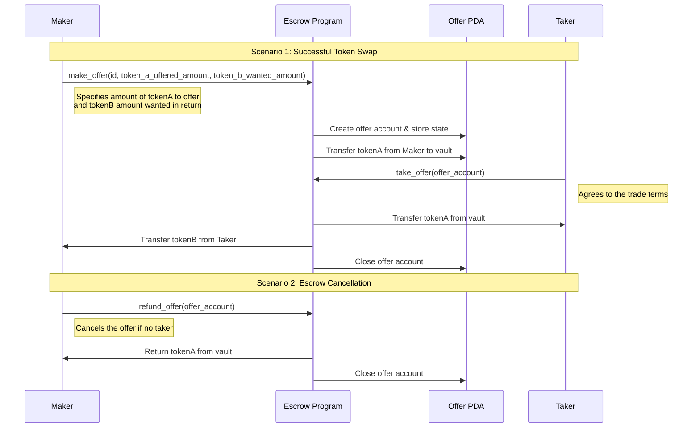

# Solana Escrow Program 2025 from Turbin3

## 🎉 Project Milestones
- ✅ Successfully migrated to Escrow 2025 reference architecture
- ✅ Implemented modern Solana stack with `@solana/kit`, Kite, and Codama
- ✅ All tests passing for make_offer, take_offer, and refund_offer operations
- ✅ Enhanced code structure and organization

## Overview
This Escrow Program is a smart contract built on Solana using Anchor. It facilitates secure token swaps between users without requiring direct trust. The escrow holds tokens from a maker until a taker fulfills the exchange conditions, at which point the tokens are transferred accordingly. If the taker does not fulfill the agreement, the maker can withdraw the tokens.

## Modern Solana Stack
This project has been updated to use the latest Solana development technologies:

- **Anchor 0.31.0**: Latest version of the Solana smart contract framework
- **@solana/kit**: Modern client-side utilities for Solana
- **Solana-Kite**: Simplified wallet and token management 
- **Codama**: Modern TS client generation from Anchor IDL

## Token Swap Flow
The following sequence diagram illustrates the high-level flow of the escrow program:



## Directory Structure
```
└── Turbin3-Escrow/
    ├── README.md
    ├── Anchor.toml
    ├── Cargo.toml
    ├── create-codama-client.ts
    ├── package.json
    ├── tsconfig.json
    ├── prettier.config.js
    ├── .prettierignore
    ├── migrations/
    │   └── deploy.ts
    ├── programs/
    │   └── escrow/
    │       ├── Cargo.toml
    │       ├── Xargo.toml
    │       └── src/
    │           ├── constants.rs
    │           ├── error.rs
    │           ├── lib.rs
    │           ├── handlers/
    │           │   ├── make_offer.rs
    │           │   ├── mod.rs
    │           │   ├── refund.rs
    │           │   ├── shared.rs
    │           │   └── take_offer.rs
    │           └── state/
    │               ├── mod.rs
    │               └── offer.rs
    ├── dist/
    │   └── js-client/
    │       └── [Generated TypeScript client files]
    └── tests/
        └── escrow.test.ts
```

## Key Features

1. **Secure Token Escrow**
   - Uses Anchor PDAs (Program Derived Addresses) for secure token storage
   - Implements proper authentication checks for all operations

2. **Full Token Swap Functionality**
   - `make_offer`: Create an offer and deposit tokens
   - `take_offer`: Complete a swap by providing the required tokens
   - `refund_offer`: Allow the maker to withdraw their tokens if the swap hasn't been taken

3. **Optimized for Performance**
   - Uses `Box<>` for large account structures to prevent stack overflow errors
   - Efficiently manages memory to handle complex transactions

4. **Token Standard Support**
   - Compatible with both SPL Token and Token-2022 standards via Token Interface

### 🧪 Test Results

```
string offer
address B3yyK5gwgWFo78CZ256fjkhMEX2Q168Cy4iBPD5V2ngg
▶ Escrow
  ✔ Puts the tokens Alice offers into the vault when Alice makes an offer (470.489166ms)
string offer
address B3yyK5gwgWFo78CZ256fjkhMEX2Q168Cy4iBPD5V2ngg
  ✔ Puts the tokens from the vault into Bob's account, and gives Alice Bob's tokens, when Bob takes an offer (467.330417ms)
  ✔ Returns tokens to Alice when she refunds her offer (933.442458ms)
✔ Escrow (18598.789291ms)
ℹ tests 3
ℹ suites 1
ℹ pass 3
ℹ fail 0
ℹ cancelled 0
ℹ skipped 0
ℹ todo 0
```

The test results show:
1. **Successful creation** of an offer with proper state initialization 
2. **Successful token swap** through the take_offer instruction
3. **Successful refund** of tokens to the maker

All three core functions pass their tests, confirming the program works as designed.

## Building and Testing

```bash
# Install dependencies
npm install

# Generate the TypeScript client
npx tsx create-codama-client.ts

# Build the program
anchor build

# Run tests
anchor test
```

## Deployment Steps
```bash
# Build & Deploy the Program
anchor build
anchor deploy

# Generate TypeScript client
npx tsx create-codama-client.ts
```

## Security Considerations

The program implements several security measures:
- PDAs for secure token custody
- Proper validation of all accounts
- Checks to ensure only authorized parties can access funds
- Constraints to validate token mint addresses and amounts

## Future Improvements

1. **Fee Structure**: Add a small fee for the escrow service
2. **Time-locks**: Implement expiration for escrows that aren't claimed within a certain timeframe
3. **Multi-token Escrows**: Extend the program to support trading multiple tokens at once
4. **Front-end Integration**: Build a web interface to interact with the escrow program

## Conclusion
This Escrow Program provides a robust and trustless way to exchange tokens securely on Solana, leveraging the latest Anchor framework and Solana technologies. The migration to the modern 2025 reference architecture ensures the code follows best practices and is optimized for the current Solana ecosystem. 